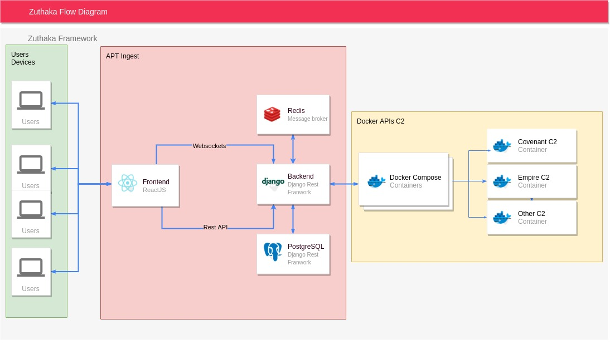

<div align="center">
  <a href="https://docs.zuthaka.com">
    
  </a>
  <br />

  <a href="https://discord.gg/bhRemvxqm6">
    
  </a>
  <a href="https://twitter.com/pucara">
    
  </a>
  <a href="https://github.com/pucarasec/zuthaka/issues">
    
  </a>

</div>
<br />
<p align="center">

  <p align="center">
A collaborative free open-source Command & Control integration framework that allows developers to concentrate on the core function and goal of their C2.
    <br />
    <a href="https://docs.zuthaka.com/"><strong>Explore the docs »</strong></a>
    <br />
    <br />
    <!--<a href="https://youtbe.com">View Demo</a> -->
    ·
    <a href="https://github.com/pucarasec/zuthaka/issues">Report Bug</a>
    ·
    <a href="https://github.com/pucarasec/zuthaka/issues">Request Feature</a>
  </p>
</p>


<details open="open">
  <summary>Table of Contents</summary>
  <ol>
    <li>
      <a href="#about-the-project">About The Project</a>
      <ul>
        <li><a href="#problem-statement">Problem statement</a></li>
        <li><a href="#solution">Solution</a></li>
        <li><a href="#built-with">Built With</a></li>
      </ul>
    </li>
    <li>
      <a href="#getting-started">Getting Started</a>
      <ul>
        <li><a href="#prerequisites">Prerequisites</a></li>
        <li><a href="#installation">Installation</a></li>
      </ul>
    </li>
    <li><a href="#usage">Usage</a></li>
    <li><a href="#roadmap">Roadmap</a></li>
    <li><a href="#license">License</a></li>
    <li><a href="#contact">Contact</a></li>
  </ol>
</details>


## About the project
### Problem Statement

The current C2s ecosystem has rapidly grown in order to adapt to modern red team operations and diverse needs \(further information on C2 selection can be found [here](https://www.thec2matrix.com/)\). This comes with a lot of overhead work for Offensive Security professionals everywhere. Creating a C2 is already a demanding task, and most C2s available lack an intuitive and easy to use web interface. Most Red Teams must independently administer and understand each C2 in their infrastructure.

### Solution

With the belief that community efforts surpass that of any individual, Zuthaka presents a simplified API for fast and clear integration of C2s and provides a centralized management for multiple C2 instances through a unified interface for Red Team operations.

Zuthaka is more than just a collection of C2s, it is also a solid foundation that can be built upon and easily customized to meet the needs of the exercise that needs to be accomplish. This integration framework for C2 allows developers to concentrate on a unique target environment and not have to reinvent the wheel.


### Built With

* [Django Rest Framework](https://www.django-rest-framework.org/)
* [Redis](https://redis.io/)
* [ReactJS](https://reactjs.org)
* [Nginx](https://www.nginx.com/)
* [Docker](https://www.docker.com/)
* [PostgreSQL](https://www.postgresql.org//)


## Getting Started

Zuthaka is composed of a front-end that exposes a UI for the API of process manager, file manager, shell post-exploitation modules and general C2 handling, and a back-end, in charge of handling the consistency and availability issues of the C2s instantiated in Zuthaka. Also deployed is Redis as a message broker to handle asynchronously every element in the Agent's UI and an Nginx server.

### Prerequisites

The installation of a working Docker instance is necessary for the automatic deployment of the essential infrastructure (Zuthaka's frontend and backend, Nginx, Redis). All the desired C2s that need to be handled should be deployed in parallel.

### Installation

To build the full Zuthaka project, first download dependencies.
```
 git clone https://github.com/pucara/zuthaka
```

To start the project with the corresponding services, the docker-compose file can be utilized.
```
docker-compose up
```

## Usage

After de solution is deployed, the available class handlers will be incorporated on zuthaka for you to use it to integrate your infrastructure.

_For further information, please refer to the [Documentation](https://docs.zuthaka.com)_


## Unreleased                                        

### Added

* service instantiation of C2
* service creation of listeners
* service deletion of listeners
* service download of launchers
* service agent integration
* Automatic database collection of handler classes
* "out of the box" listing of ProcessManager and FileManager

### Roadmap

* service usage of post-exploitation modules

## License

Distributed under the BSD-3 clause License. See `LICENSE.md` for more information.

## Contact


Pucara team - [@pucara](https://twitter.com/pucara) - contant@pucara.io

Zuthaka community on discord - [Zuthaka](https://discord.gg/2wwBJR8ksn)

Project Link: [https://github.com/pucarasec/zuthaka](https://github.com/pucarasec/zuthaka)


